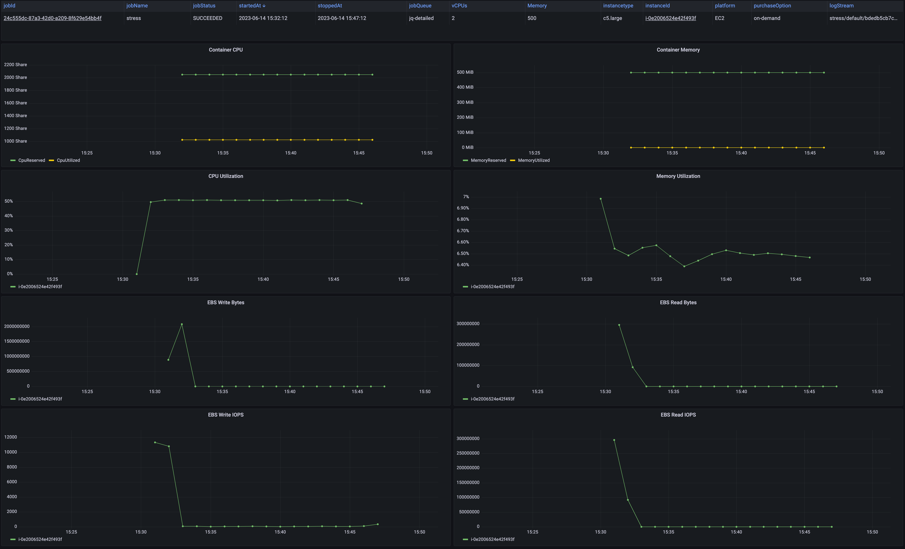
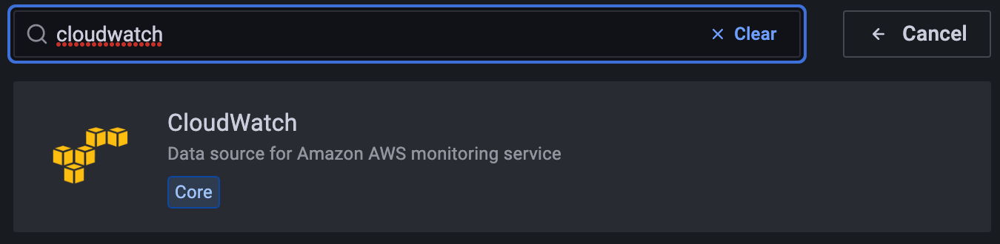
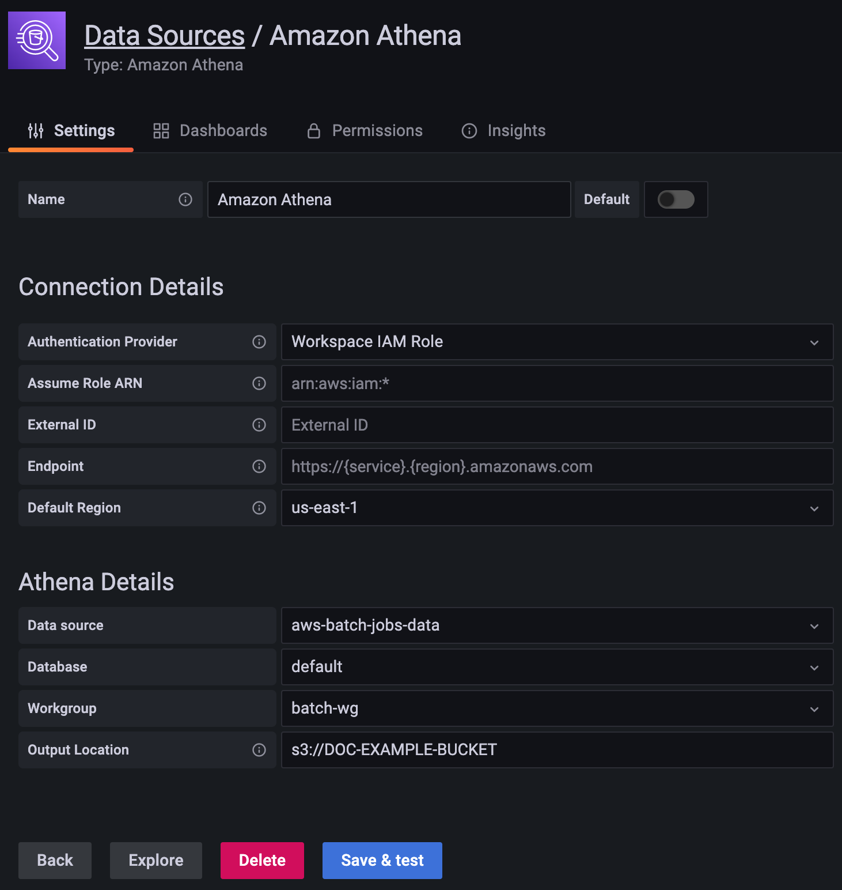
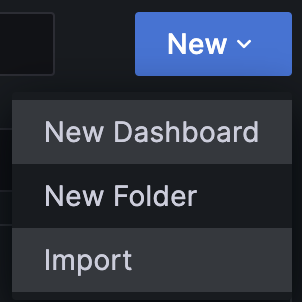
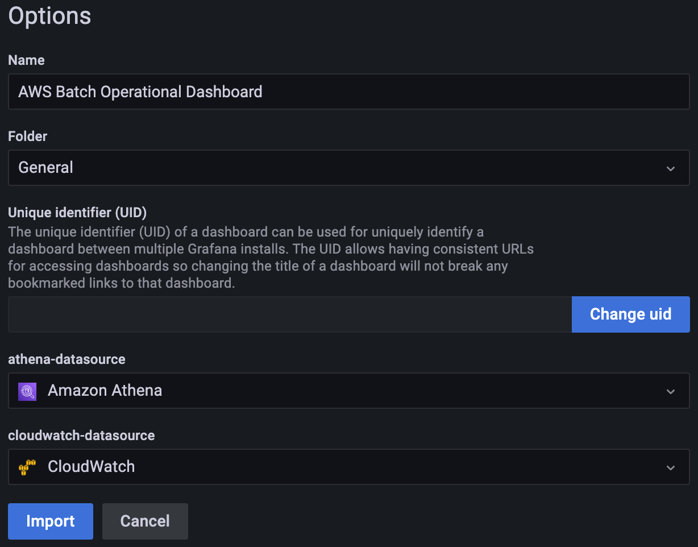

# AWS Batch Operational Dashboard

**AWS Batch Operational Dashboard** provides a code sample to deploy a solution to show Amazon EC2 resources and Container resource usage by AWS Batch jobs.

This solution relies on a serverless architecture to create a Grafana dashboard to visualize compute and memory resources usage by AWS Batch jobs.
It provides better insights at the jobs level on how Amazon EC2 resources are used.

This application is designed to be scalable by collecting data from events and API calls using Amazon EventBrige and does not make API calls to describe your resources. Data collected through events and API are partially aggregated to DynamoDB to recoup information and generate Amazon CloudWatch metrics with the Embedded Metric Format. The application also deploys a several of dashboards displaying the job states, Amazon EC2 instances belonging your Amazon ECS Clusters (AWS Batch Compute Environments), ASGs across Availability Zones.

## Prerequisites

Install AWS Serverless Application Model Command Line Interface (AWS SAM CLI) version **>=1.72.0** by following the [instructions](<https://docs.aws.amazon.com/serverless-application-model/latest/developerguide/install-sam-cli.html>)

## Dashboard

The dashboard allows to visualize AWS Batch jobs status, start and stop time, job queue, instance type, instance id, availability zone, Amazon Cloudwatch logs associated with the job.
In addition, you can navigate through time and focus on a specific AWS Batch job to observe the Amazon EC2 CPU and Memory usage, the container CPU and memory requested and used as well as the EBS operations that are related to the job.

 <br />

## Architecture

The architecture track AWS Batch job events through Amazon EventBrige that are routed to a step function that store the AWS job states, availability zones, instance type, instance id, instance pricing model, log stream in a DynamoDB database.
You can visualize the the results using Amazon Managed Grafana through Amazon Athena.


## Deployment

The deployment of the dashboard is composed of four steps.

### AWS Organization and AWS IAM Identity Center

Amazon Managed Grafana relies on single sign-on using your organization’s identity provider to authenticate users.
The following steps guide you to setup [AWS Organization](https://aws.amazon.com/organizations/), and [AWS IAM Identity Center](https://aws.amazon.com/iam/identity-center/).

**NOTE**: If you already have AWS Organization and AWS IAM Identity Center you can skip those steps.

#### 1. Create an AWS Organizations

1. Open [AWS Organization](<https://console.aws.amazon.com/organizations/v2>).
1. Choose **Create an Organization**. By default, the organization is created with all features enabled.
1. The organization is created and the AWS accounts page appears. The only account present is your management account, and it's currently under the root organizational unit (OU).

#### 2. Enable AWS IAM Identity Center

1. Open [AWS IAM Identity Center](<https://console.aws.amazon.com/singlesignon>).
1. Choose **Enable**.

### Deploy the architecture

To deploy the serverless application, run the following in your shell:

```bash
BATCH_DASHBOARD_NAME="batch-op-dashboard"
sam build
sam deploy --stack-name ${BATCH_DASHBOARD_NAME} \
    --guided \
    --capabilities CAPABILITY_IAM CAPABILITY_AUTO_EXPAND
```

Follow the instructions and fill the parameters.

Once deploy let's retrieve the Amazon Managed Grafana dashboard id.

```bash
GRAFANA_ID=`sam list stack-outputs --stack-name ${BATCH_DASHBOARD_NAME} \
    --output json | \
    jq -r '.[] | select(.OutputKey=="GrafanaWorkspaceId") | .OutputValue'`
```

### Create and add group permissions to grafana

Amazon Managed Grafana integrates with AWS IAM Identity Center to provide identity federation.
The federation provides users and groups that will grant access to Amazon Managed Grafana as a **Viewer**, **Editor** or **Admin**.
The following steps guide you to create a viewer and admin group.

#### 1. Retrieve Identity store ID.

1. Open **[AWS IAM Identity Center settings](https://console.aws.amazon.com/singlesignon/identity/home#!/settings)**
1. Copy the **Identity store ID** from the identity store tab. This will be used in the next step

#### 2. Create groups and users in IAM Identity Center

Set the identity store ID to the value copied in the previous step.

```bash
IDENTITY_STORE="d-1234567890"
```

Create grafana admin and viewer groups.

```bash
ADMIN_GROUP=`aws identitystore create-group --identity-store-id ${IDENTITY_STORE} \
    --display-name 'grafana-batch-op-dashboard-admin'\
    --query GroupId \
    --output text`

VIEWER_GROUP=`aws identitystore create-group --identity-store-id ${IDENTITY_STORE} \
    --display-name 'grafana-batch-op-dashboard-viewer' \
    --query GroupId \
    --output text`
```

Create users

```bash
USER_ID=`aws identitystore create-user --identity-store-id ${IDENTITY_STORE} \
    --user-name 'johndoe' \
    --display-name 'John'\
    --name Formatted=string,FamilyName=Doe,GivenName=John \
    --emails Value=no-reply@example.com,Type=string,Primary=True \
    --query UserId \
    --output text`
```

Add user to group. Here the **ADMIN GROUP**.

```bash
aws identitystore create-group-membership --identity-store-id ${IDENTITY_STORE} \
    --group-id ${ADMIN_GROUP} \
    --member-id UserId=${USER_ID}
```

### Setup Amazon Managed Grafana

First, you will add the groups created previously to the grafana dashboard.

```bash
aws grafana update-permissions --workspace-id ${GRAFANA_ID} \
    --update-instruction-batch \
    "action=ADD,role=ADMIN,users=[{id=$ADMIN_GROUP,type=SSO_GROUP}]"

aws grafana update-permissions --workspace-id ${GRAFANA_ID} \
    --update-instruction-batch \
    "action=ADD,role=VIEWER,users=[{id=$VIEWER_GROUP,type=SSO_GROUP}]"
```

Now let's get the URL to access the dashboard.

```bash
aws grafana describe-workspace --workspace-id ${GRAFANA_ID} \
    --query workspace.endpoint \
    --output text
```

You should get an URL that you will paste in your web browser, like **g-1234567890.grafana-workspace.us-east-1.amazonaws.com**.

You will be prompted to login with the credentials **user-name** created earlier.
At user creation, each user will receive an initial password in their emails.

Use the password from the mail associated with your user name to login.

### Create the dashboard in Amazon Managed Grafana

Once connected as administrator, you will start by settings data sources.

#### 1. Add Amazon CloudWatch Data source

1. Select the **wheel** on the side menu.<br/>
   
1. Choose **Data sources**.
1. Choose **Add data source**.
1. Choose **CloudWatch**. <br />
    <br />
1. On the **Default Region** menu, choose your **AWS Region**.
1. Choose **Save & test**.

#### 2. Add Amazon Athena Data source

Before starting, you will retrieve the S3 bucket name created to store the AWS Batch jobs data through Amazon Athena.

In a terminal:

```bash
sam list stack-outputs --stack-name ${BATCH_DASHBOARD_NAME} \
    --output json | \
    jq -r '.[] | select(.OutputKey=="AthenaSpillBucket") | .OutputValue'
```

Copy the output that you will use in the setup of Amazon Athena data source in Amazon Managed Grafana.

In the Amazon Managed Grafana dashboard:

1. Select the **wheel** on the side menu.<br/>
   
1. Choose **Data sources**.
1. Choose **Add data source**.
1. Choose **Amazon Athena**.<br />
    <br />
1. On the **Default Region** menu, choose your **AWS Region**.
1. On the **Data source** menu, choose **aws-batch-jobs-data**.
1. On the **Database** menu, choose **default**.
1. On the **Workgroup** menu, choose **batch-wg**.
1. On the **Output Location** menu, copy paste the bucket value **s3://DOC-EXAMPLE-BUCKET**.
1. Choose **Save & test**.

#### 3. Create dashboard

To create a dashboard in Amazon Managed Grafana for AWS Batch, you will start from the template provided in this repository to generate dashboard for your environment.

In a terminal, run the following commands:
```bash
python3 -m venv env
source env/bin/activate
pip install -r requirements.txt

TABLE=`sam list stack-outputs --stack-name ${BATCH_DASHBOARD_NAME} \
    --output json | \
    jq -r '.[] | select(.OutputKey=="AthenaDataSource") | .OutputValue'`

python3 ./generate-grafana-dashboard.py --table ${TABLE}
```

Once you have created your dashboard in json format, you will import it in Amazon Managed Grafana:
1. Select the **squares** on the side menu.<br/>
     <br />
1. Choose **Import**. <br />
1. Choose **Upload JSON file**, select the `batch-grafana-dashboard.json` file.
1. Choose **Load**.
1. Select the **Athena** and **CloudWatch** data sources your created previously.
    <br />
1. Choose **Import**.

You will be redirected to the dashboard you imported.
Once you will have your first AWS Batch jobs running.
You will be able to see the data associated with it in the dashboard.

## Clean up
To delete the SAM application deployment, you can use the terminal and enter:

```bash
sam delete
```

## Security

See [CONTRIBUTING](CONTRIBUTING.md#security-issue-notifications) for more information.

## License

This library is licensed under the MIT-0 License. See the LICENSE file.

